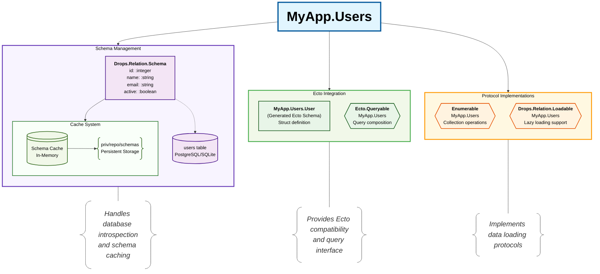

# Introduction

Drops.Relation is a high-level relation abstraction with extensible architecture built on top of `Ecto.SQL`, created to accelerate development with `Ecto` in both early stages and as applications grow and become more complex.

> #### Faster development {: .tip}
>
> When using Drops.Relation you make relations, aka data, a first-class citizen in your application. You are equiped with tools to define data structures that are specific to your application and work with it effectively, as all the boilerplate code is not needed, while preserving full control for when the time is right.

To improve and speed up development of Elixir applications, Drops.Relation provides the following benefits:

- Schema inference - not only does `Drops.Relation` infer schemas and define underlying Ecto schemas automatically, but it also provides various meta-data about the fields that can be leveraged to build additional solutions
- Streamlined Query API - because relations are 1st-class, top-level concepts, they hide details like the underlying Repos and database adapters.
- Query composition - you can compose relations and their underlying Ecto queries with ease
- Relation views - define custom views derived from base relations whenever the canonical representation is no longer a good fit in a given context
- Batteries included - `Drops.Relation` provides a set of built-in plugins that cover most common use cases, you can also easily extend it with custom plugins to fit your specific needs

## Architecture Overview



## Comparison with Ecto

Drops.Relation mimics some of the functions from `Ecto.Repo` to make things consistent and familiar. The goal is to provide a more convenient and composable API for working with databases while properly leveraging and encapsulating `Ecto.Repo` and `Ecto.Query` under the hood.

### Schema Definition

<!-- tabs-open -->

### Ecto

```elixir
defmodule MyApp.User do
  use Ecto.Schema

  schema "users" do
    field :name, :string
    field :email, :string
    field :active, :boolean
    timestamps()
  end
end
```

### Drops.Relation

```elixir
defmodule MyApp.Users do
  use Drops.Relation, otp_app: :my_app

  schema("users", infer: true)
end
```

<!-- tabs-close -->

### Schema with Custom Fields

<!-- tabs-open -->

### Ecto

```elixir
defmodule MyApp.User do
  use Ecto.Schema

  schema "users" do
    field :name, :string
    field :email, :string
    field :active, :boolean, default: true
    field :role, :string, default: "member"
    timestamps()
  end
end
```

### Drops.Relation

```elixir
defmodule MyApp.Users do
  use Drops.Relation, otp_app: :my_app

  schema("users", infer: true) do
    field(:role, :string, default: "member")
  end
end
```

<!-- tabs-close -->

## Query Functions

<!-- tabs-open -->

### Ecto

```elixir
users = Repo.all(User)

user = Repo.get(User, 1)

active_users = Repo.all_by(User, active: true)
```

### Drops.Relation

```elixir
users = MyApp.Users.all()

user = MyApp.Users.get(1)

active_users = MyApp.Users.all_by(active: true)
```

<!-- tabs-close -->

### Custom Query Definition

<!-- tabs-open -->

### Ecto

```elixir
defmodule MyApp.Users do
  import Ecto.Query

  def active(query) do
    from u in query, where: u.active == true
  end

  def by_role(query, role) do
    from u in query, where: u.role == ^role
  end

  def order(query, field) do
    from u in query, order_by: ^field
  end
end

User
  |> MyApp.Users.active()
  |> MyApp.Users.by_role("member")
  |> MyApp.Users.order_by(:name)
  |> Repo.all()
```

### Drops.Relation

```elixir
defmodule MyApp.Users do
  use Drops.Relation, otp_app: :my_app

  schema("users", infer: true)

  defquery active() do
    from(u in relation(), where: u.active == true)
  end

  defquery by_role(role) do
    from(u in relation(), where: u.role == ^role)
  end
end

MyApp.Users.active()
  |> MyApp.Users.by_role("member")
  |> MyApp.Users.order(:name)
  |> Repo.all()
```

<!-- tabs-close -->
